# 本地多模态AI文献与图像管理助手 (Local Multimodal AI Agent)
## 1. 项目简介 (Project Introduction)
本项目是一款基于Python的本地化多模态AI管理工具，专注解决本地文献（PDF）和图像素材的高效管理难题。不同于传统文件名检索，项目依托多模态神经网络技术，实现**语义级搜索**与**智能自动分类**，无需依赖云端服务，兼顾隐私安全与处理效率。

无论是学术科研中的文献整理，还是日常学习中的图像素材管理，工具都能通过本地化模型快速完成分类、检索等操作。同时支持命令行与Web可视化双界面，适配不同使用场景，还可通过配置文件灵活调整模型、阈值等参数，满足个性化需求。

## 2. 核心功能 (Core Features)
### 2.1 智能文献管理
- **语义搜索**：支持自然语言查询（如“Transformer的注意力机制原理”），返回相关论文及匹配段落、页码，精准定位核心内容。
- **自动分类与整理**：
  - 单篇处理：添加PDF时自动分析内容，归类到CV、NLP、RL、Multimodal等主题文件夹。
  - 批量整理：一键扫描指定目录所有PDF，完成分类归档与重复文件清理。
- **文件索引**：支持仅返回匹配文件列表，快速定位目标文献，避免冗余信息干扰。

### 2.2 智能图像管理
- **以文搜图**：通过自然语言描述（如“卷积神经网络的结构示意图”“海边日落风景”），匹配本地图像库中最相关的素材。
- **批量处理**：支持批量导入图像并自动生成嵌入向量，高效构建本地图像知识库。

### 2.3 双界面支持
- 命令行界面（CLI）：适合熟悉终端操作的用户，快速执行批量任务。
- Web可视化界面：直观的图形化操作，支持所有核心功能，无需记忆命令。

## 3. 技术选型 (Technical Stack)
项目采用模块化设计，核心依赖如下，所有模型均支持本地部署，无需联网：

### 3.1 核心模型
- **文本嵌入模型**：`all-MiniLM-L6-v2`
  - 轻量高效（约22M参数），生成384维向量
  - 支持中英文语义理解，适配学术文本场景
- **图像嵌入模型**：`clip-ViT-L-14`
  - 跨模态匹配能力强，生成768维向量
  - 支持文本-图像语义对齐，精准响应以文搜图需求
- **本地LLM**：`Qwen2-7B-Instruct`
  - 用于论文分类、查询理解与结果重排序
  - 支持float16精度，适配GPU加速（CUDA/MPS）

### 3.2 关键依赖
- 向量数据库：`ChromaDB`（嵌入式存储，无需独立服务，支持余弦相似度检索）
- PDF处理：`pypdf`（提取文本、段落及页码信息）
- 图像处理：`Pillow`（图像加载与预处理）
- 框架与工具：`PyTorch`（模型推理）、`transformers`（模型加载）、`Flask`（Web界面）、`click`（命令行交互）
- 辅助工具：`tqdm`（进度显示）、`logging`（日志记录）

### 3.3 项目结构
```
Local_Multimodal_AI_Agent/
├── main.py                 # 命令行入口
├── web.py                  # Web界面入口
├── config.py               # 全局配置文件
├── requirements.txt        # 依赖列表
├── models/                 # 本地模型存储目录
│   ├── all-MiniLM-L6-v2/   # 文本嵌入模型
│   ├── clip-ViT-L-14/      # 图像嵌入模型
│   └── Qwen2-7B-Instruct/  # 本地LLM模型
├── data/                   # 数据存储目录（自动生成）
│   ├── papers/             # 分类后的论文
│   ├── images/             # 导入的图像素材
│   ├── vector_db/          # 向量数据库持久化文件
│   └── model_cache/        # 模型缓存目录
├── logs/                   # 日志文件目录
└── src/                    # 核心功能模块
    ├── document_processor.py  # 论文处理
    ├── image_processor.py     # 图像处理
    ├── embedding.py           # 嵌入向量生成
    ├── vector_db.py           # 向量数据库操作
    └── utils.py               # 通用工具
```

## 4. 环境配置 (Environment Setup)
### 4.1 环境要求
- 操作系统：Windows / macOS / Linux
- Python版本：3.8 及以上
- 硬件要求：
  - 内存：≥4GB（基础运行），≥8GB（加载LLM模型）
  - GPU（可选）：NVIDIA CUDA GPU 或 Apple Silicon（MPS），可显著提升模型推理速度
  - 磁盘空间：≥20GB（用于存储模型、数据及缓存）

### 4.2 安装步骤
#### 4.2.1 基础环境配置
1. 克隆/下载项目代码，进入项目根目录：
   ```bash
   git clone https://github.com/Eternal12581/Local_Multimodal_AI_Agent.git
   cd Local_Multimodal_AI_Agent
   ```
2. 安装Python依赖：
   ```bash
   pip install -r requirements.txt
   ```

#### 4.2.2 本地模型下载
项目依赖3类本地模型，需手动下载并放置到 `models/` 目录（目录需手动创建）：
| 模型类型         | 模型名称                | 下载来源                                                                 | 放置路径                  |
|------------------|-------------------------|--------------------------------------------------------------------------|---------------------------|
| 文本嵌入模型     | all-MiniLM-L6-v2        | [HuggingFace](https://huggingface.co/sentence-transformers/all-MiniLM-L6-v2) | models/all-MiniLM-L6-v2/  |
| 图像嵌入模型     | clip-ViT-L-14           | [HuggingFace](https://huggingface.co/openai/clip-vit-large-patch14)       | models/clip-ViT-L-14/     |
| 本地LLM          | Qwen2-7B-Instruct       | [HuggingFace](https://huggingface.co/Qwen/Qwen2-7B-Instruct)              | models/Qwen2-7B-Instruct/ |

- 模型下载后需保持目录结构与上表一致，否则需修改 `config.py` 中对应模型路径配置。
- 若网络较慢，可使用HuggingFace镜像源加速下载（如设置环境变量 `export HF_ENDPOINT=https://hf-mirror.com`）。

#### 4.2.3 验证安装
运行以下命令，若显示命令帮助信息则说明基础环境配置成功：
```bash
python main.py --help
```

## 5. 使用说明 (Usage Guide)
支持**命令行（CLI）** 和**Web界面**两种使用方式，核心功能完全对齐，可按需选择。

### 5.1 命令行使用（CLI）
#### 5.1.1 文献管理功能
##### （1）添加单篇论文并自动分类
```bash
# 基础用法（使用默认主题分类：CV/NLP/RL/Multimodal/Other）
python main.py add_paper "path/to/your/paper.pdf"

# 自定义分类主题（用逗号分隔）
python main.py add_paper "path/to/your/paper.pdf" --topics "CV,NLP"
```
- 论文会自动移动到 `data/papers/<主题>/` 目录，向量信息存入数据库。

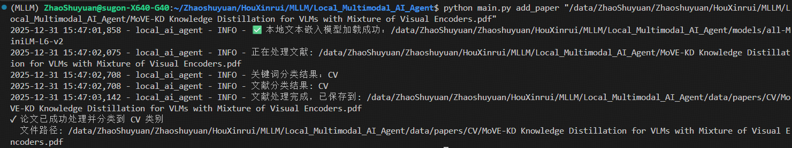

##### （2）批量添加论文
```bash
# 批量处理目录下所有PDF（含子目录）
python main.py batch_add_papers "path/to/your/papers_dir"

# 自定义分类主题
python main.py batch_add_papers "path/to/your/papers_dir" --topics "RL,Multimodal"
```

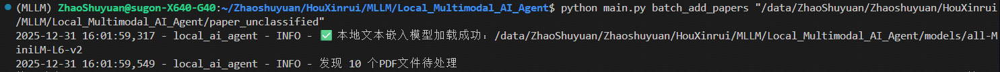
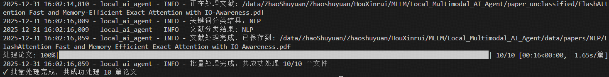
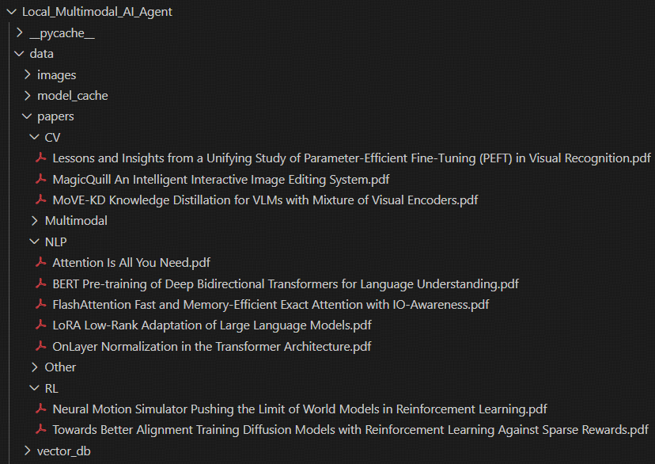

##### （3）一键整理论文
```bash
# 整理默认目录（data/papers）下的所有论文（重新分类+清理重复）
python main.py organize_papers

# 自定义整理目录
python main.py organize_papers --papers-dir "path/to/your/papers_dir" --topics "CV,NLP"
```

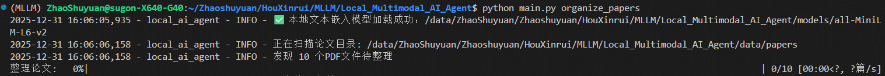
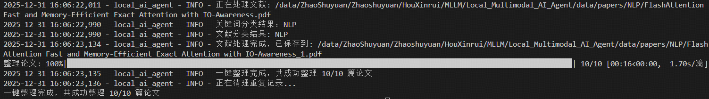

##### （4）语义搜索论文
```bash
# 基础搜索（返回1篇相关论文，默认显示详细信息）
python main.py search_paper "Transformer的核心架构"

# 自定义返回数量
python main.py search_paper "图像分类 卷积神经网络" --limit 5

# 仅返回文件名列表（文件索引模式）
python main.py search_paper "reinforcement learning policy gradient" --index

# 返回匹配段落和页码（精细化检索）
python main.py search_paper "Q-learning算法原理" --snippets
```

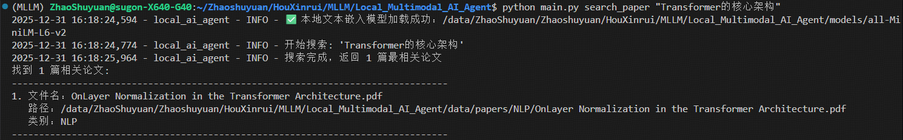
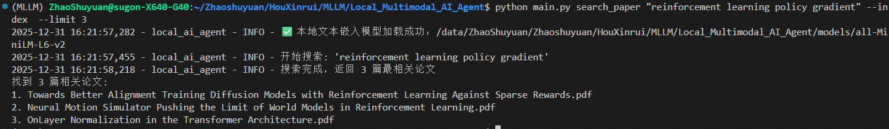
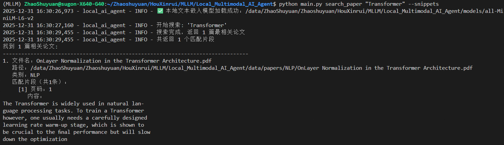

#### 5.1.2 图像管理功能
##### （1）添加单张图像
```bash
python main.py add_image "path/to/your/image.jpg"
```
- 支持格式：JPG、PNG、GIF、BMP、TIFF，图像自动复制到 `data/images/` 目录。

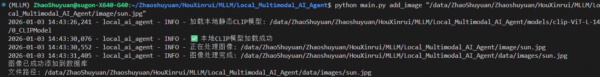

##### （2）批量添加图像
```bash
python main.py batch_add_images "path/to/your/images_dir"
```

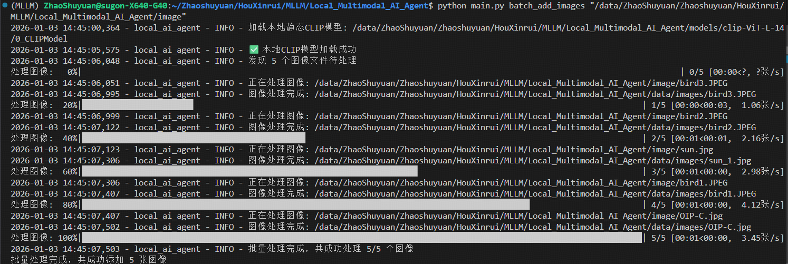

##### （3）以文搜图
```bash
# 基础搜索（返回1张相关图像）
python main.py search_image "海边的日落"

# 自定义返回数量
python main.py search_image "卷积神经网络结构示意图" --limit 5
```

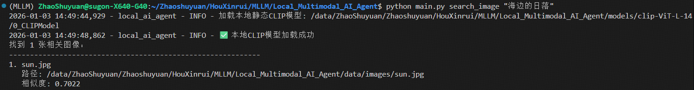
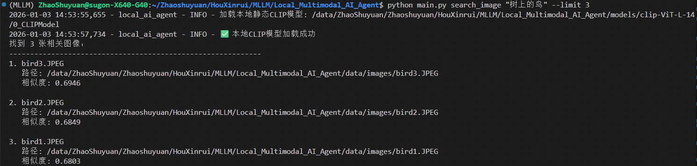

### 5.2 Web界面使用
#### 5.2.1 启动Web服务
```bash
python web.py
```
- 服务默认运行在 `http://0.0.0.0:5001`，打开浏览器访问该地址即可进入可视化界面。

#### 5.2.2 界面功能说明
界面分为「论文管理」和「图像管理」两大标签页，功能与命令行一一对应：
1. **论文管理**：
   - 单篇/批量添加论文，支持自定义分类主题。
   - 一键整理：选择目录后自动完成分类与去重。
   - 语义搜索：输入查询词，可配置返回数量、是否显示片段等参数，结果实时展示。

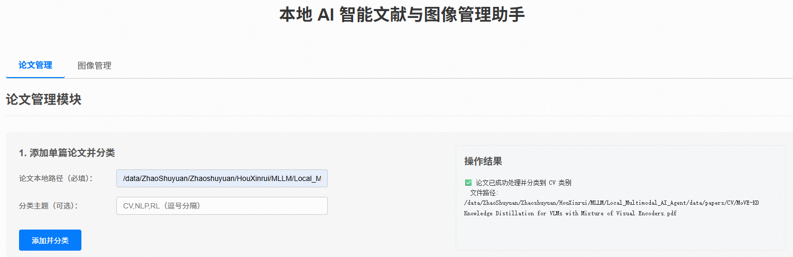
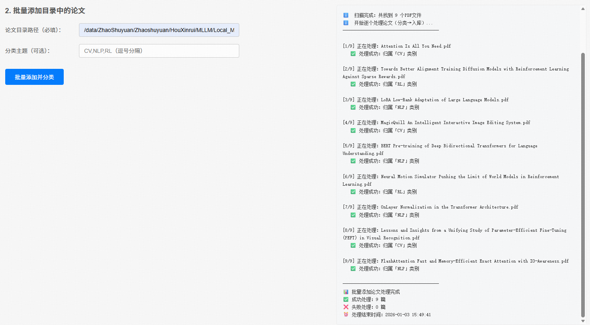
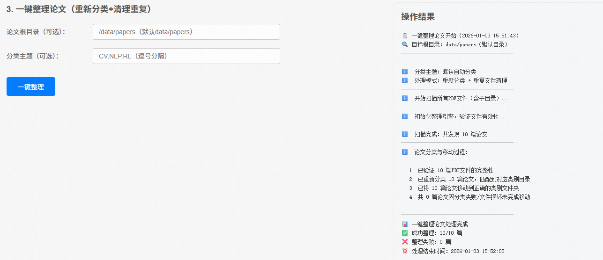
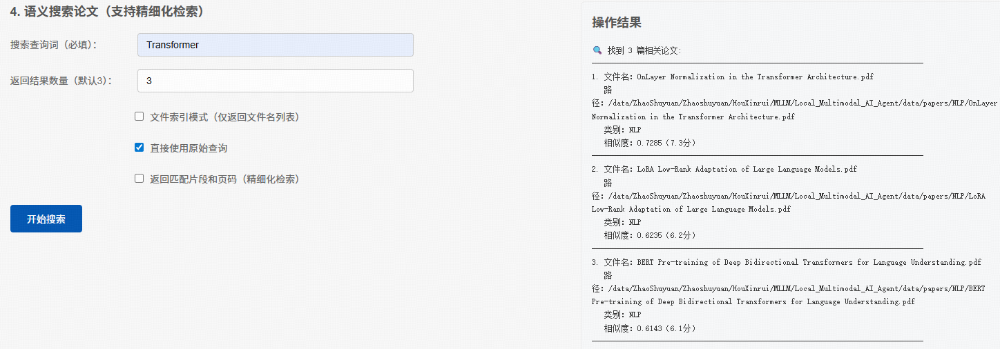

2. **图像管理**：
   - 单张/批量导入图像，自动完成嵌入存储。
   - 文本搜索图像：输入描述词，按相似度排序返回结果。

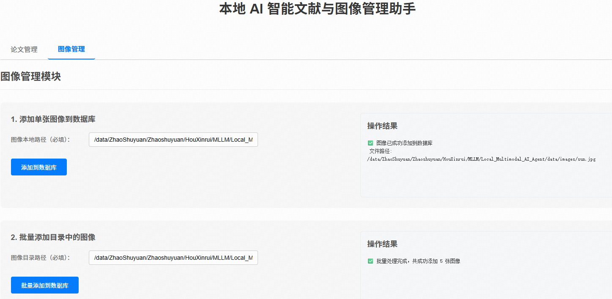
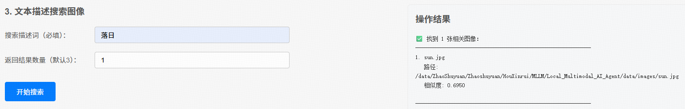

### 5.3 配置自定义（Optional）
若需调整模型、阈值等参数，可直接修改项目根目录的 `config.py`：
- 分类主题：修改 `DEFAULT_TOPICS` 列表，支持新增/删除主题。
- 相似度阈值：调整 `SIMILARITY_THRESHOLD`（论文分类）、`SEARCH_SIMILARITY_THRESHOLD`（搜索匹配）。
- 模型配置：修改 `TEXT_EMBEDDING_MODEL`、`IMAGE_EMBEDDING_MODEL` 等路径，切换其他兼容模型。
- GPU/CPU设置：自动检测设备，可手动指定 `DEVICE` 为 "cuda"、"mps" 或 "cpu"。

## 6. 数据存储说明 (Data Storage)
- 论文文件：分类后存储在 `data/papers/<主题>/` 目录，按主题自动归档。
- 图像文件：统一存储在 `data/images/` 目录，自动处理同名文件冲突。
- 向量数据库：持久化存储在 `data/vector_db/persist/`，支持断电后恢复。
- 日志文件：存储在 `logs/` 目录，按日期记录操作过程与错误信息。
- 模型缓存：自动生成在 `data/model_cache/`，避免重复下载模型文件。

## 7. 注意事项 (Notes)
1. 模型加载要求：首次运行需确保所有模型已正确放置到 `models/` 目录，否则会报错。
2. GPU加速：若检测到NVIDIA CUDA或Apple Silicon MPS，会自动启用GPU加速；显存不足时会自动切换到CPU。
3. 论文处理：仅支持PDF格式，若PDF损坏或加密，会跳过处理并记录日志。
4. 重复文件：批量添加或整理时，会自动保留原始文件，删除重复副本。
5. 端口占用：Web服务默认使用5001端口，若端口被占用，可修改 `web.py` 中 `app.run(port=xxx)` 更换端口。

## 8. 常见问题排查 (Troubleshooting)
- 模型下载失败：使用HuggingFace镜像源，或手动下载模型文件后解压到指定路径。
- 显存不足：在 `config.py` 中降低 `TEXT_EMBEDDING_BATCH_SIZE`、`IMAGE_EMBEDDING_BATCH_SIZE`，或强制使用CPU（设置 `DEVICE="cpu"`）。
- 搜索无结果：检查查询词是否准确，或降低 `SEARCH_SIMILARITY_THRESHOLD` 阈值。
- Web界面无法访问：确保本地端口未被占用，防火墙未拦截，访问地址为 `http://localhost:5001`。

## 9. 演示视频 (demo video)

<video controls src="assets/video1.mp4" title="Title"></video>

https://github.com/Eternal12581/Local_Multimodal_AI_Agent/blob/main/assets/video1.mp4

https://github.com/user-attachments/assets/af091f51-3a7e-4168-ad6b-67f65c8f7c08

<video controls src="assets/video2.mp4" title="Title"></video>

https://github.com/Eternal12581/Local_Multimodal_AI_Agent/blob/main/assets/video2.mp4

https://github.com/user-attachments/assets/70daf7f0-28b6-4f3f-b133-db018cedd966
